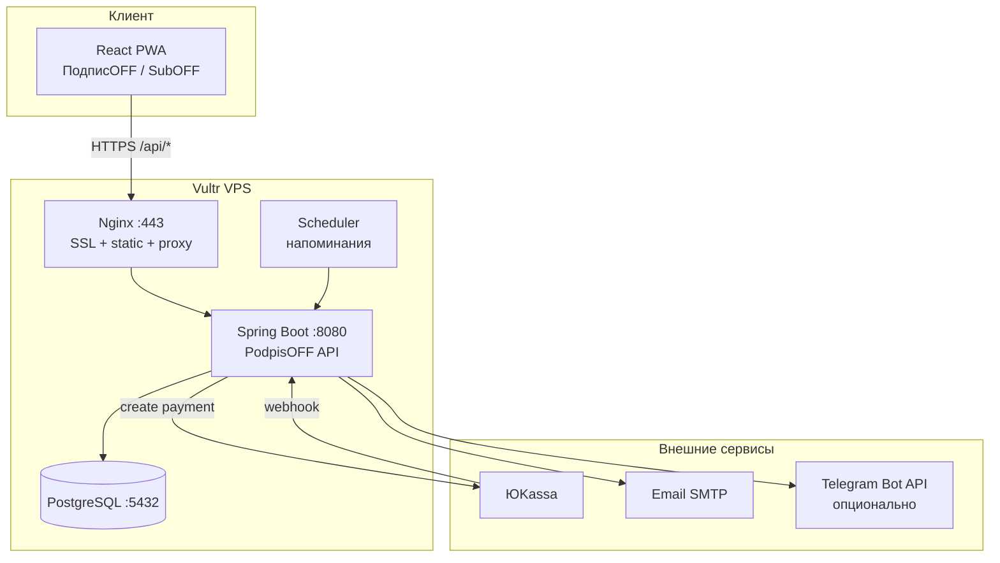
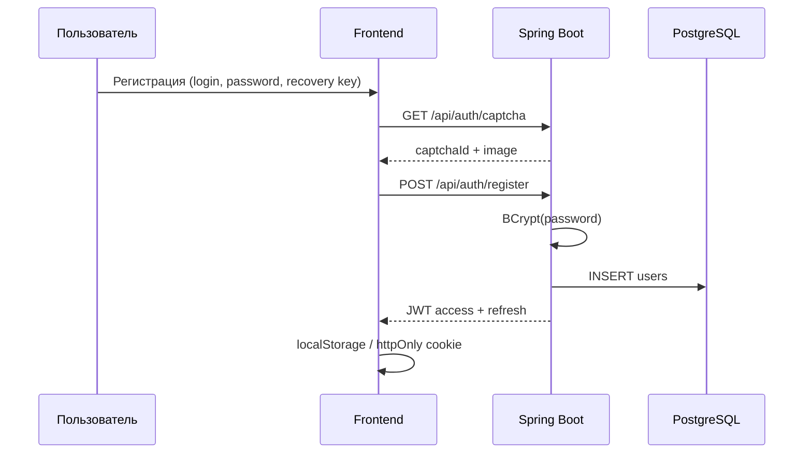
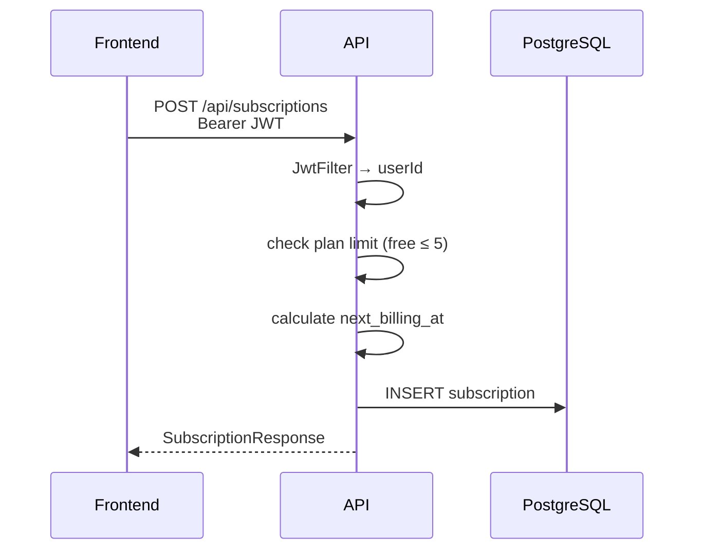
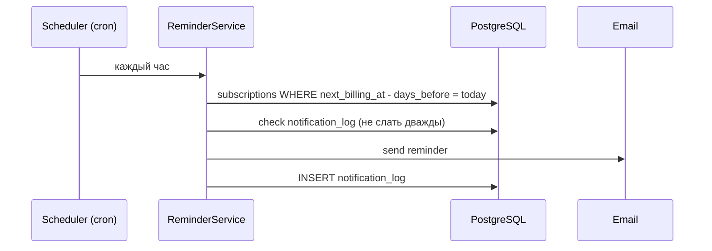
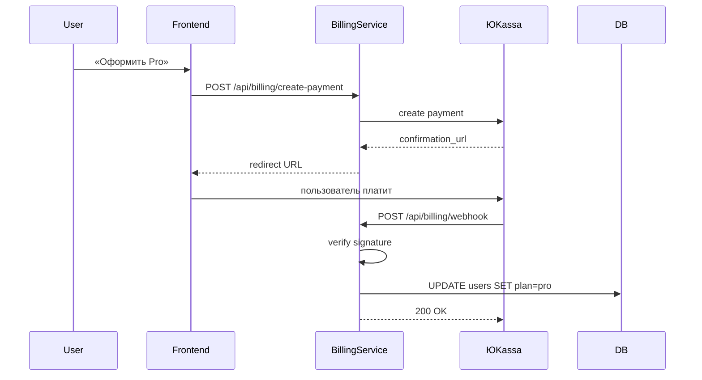

# Архитектура ПодписOFF · SubOFF

## Обзор

ПодписOFF (SubOFF) — **modular monolith**: один Spring Boot процесс с чёткими модулями внутри, React PWA на фронте, PostgreSQL для данных.

Выбран monolith (а не микросервисы как в TheGreatHike), потому что:

- один разработчик — один деплой, один лог, одна БД;
- MVP быстрее;
- нагрузка на старте низкая (< 1000 пользователей);
- при росте модули можно вынести в сервисы (auth, notifications).

## Диаграмма компонентов



## Модули backend (пакеты)

```
com.podpisoff
├── auth          — регистрация, JWT, recovery key, капча
├── subscription  — CRUD подписок, расчёт next_billing_at
├── dashboard     — агрегация сумм, upcoming
├── reminder      — scheduler, отправка уведомлений
├── billing       — ЮKassa, webhooks, plan free/pro
├── export        — CSV
└── common        — security, exceptions, config, i18n
```

## Поток: регистрация и вход

Копирует проверенный паттерн TheGreatHike:



### JWT

| Token | TTL | Где |
|-------|-----|-----|
| Access | 15–60 мин | Authorization header |
| Refresh | 7–30 дней | httpOnly cookie (если «запомнить») |

Секрет JWT — переменная окружения `JWT_SECRET` (минимум 32 символа).

## Поток: добавление подписки



### Расчёт `next_billing_at`

| billing_period | Логика |
|----------------|--------|
| monthly | следующий `billing_day` в текущем/следующем месяце |
| yearly | тот же месяц/день через год |
| weekly | +7 дней от last/next |
| custom | пользователь задаёт `next_billing_at` вручную |

### Нормализация суммы для dashboard

Все суммы приводятся к **месячному эквиваленту**:

- monthly → amount
- yearly → amount / 12
- weekly → amount × 4.33
- с учётом `share_percent` (например 50% → ×0.5)

## Поток: напоминание



Scheduler: Spring `@Scheduled` или отдельный cron в Docker.

## Поток: оплата Pro



## Локализация (RU / EN)

| Элемент | RU | EN |
|---------|----|----|
| Название в UI | ПодписOFF | SubOFF |
| Статус отмены | OFF | OFF |
| Кнопка отмены | Выключить | Turn OFF |
| `users.locale` | `ru` | `en` |

Frontend: i18next или react-intl. Backend: сообщения об ошибках по `Accept-Language`.

## Безопасность

| Аспект | Решение |
|--------|---------|
| Пароли | BCrypt, cost factor 10–12 |
| Recovery key | BCrypt hash, показывается один раз при регистрации |
| API | JWT, все `/api/**` кроме auth — authenticated |
| CORS | только свой домен в prod |
| Rate limit | Bucket4j или nginx: login 5/min, register 3/min |
| Webhook ЮKassa | проверка IP + подпись |
| HTTPS | обязательно в prod (Let's Encrypt) |
| Secrets | только `.env`, не в git |

## PWA (Progressive Web App)

Фронтенд включает:

- `manifest.json` — name: «ПодписOFF» / short_name: «SubOFF»
- Service Worker — кэш статики (offline просмотр списка)
- `viewport` meta — mobile-first UI
- Push notifications (опционально, Phase 2) — Web Push API

Пользователь на Android/iPhone: «Поделиться → На экран Домой» — иконка как у приложения.
