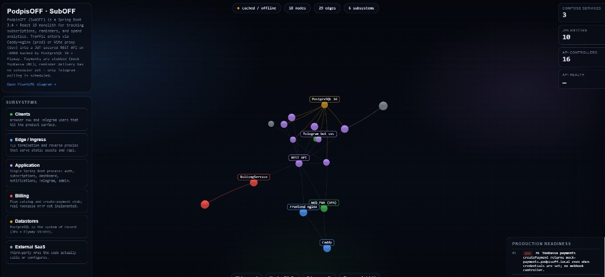
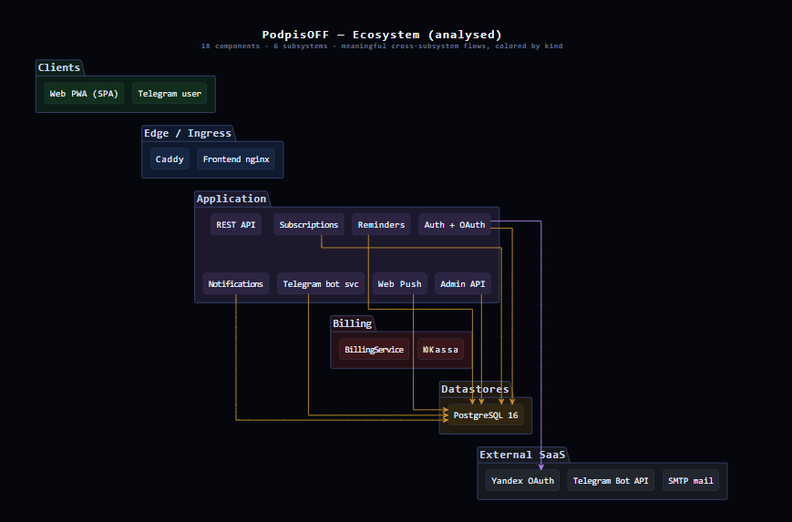

# Карта системы (System Map)

Интерактивная 3D-карта и статическая PlantUML-схема архитектуры PodpisOFF.  
Источник данных — `system-map/ecosystem-data.json` (узлы и связи по коду репозитория).

---

## Что можно посмотреть

| Что | Файл | Ссылка после запуска |
|-----|------|----------------------|
| **3D-карта** | [`system-map/index.html`](../system-map/index.html) | http://localhost:8899/ |
| **PlantUML-диаграмма** | [`system-map/diagram.html`](../system-map/diagram.html) | http://localhost:8899/diagram.html |
| **Данные (JSON)** | [`system-map/ecosystem-data.json`](../system-map/ecosystem-data.json) | — |
| **Исходник PlantUML** | [`system-map/ecosystem.puml`](../system-map/ecosystem.puml) | — |
| **SVG диаграммы** | [`system-map/ecosystem-diagram.svg`](../system-map/ecosystem-diagram.svg) | открыть файл напрямую |

---

## Как открыть

Файлы в `system-map/` уже готовы, сборка не нужна. Открывать лучше через локальный HTTP-сервер — иначе браузер может заблокировать загрузку JSON.

### 1. Только карта (backend не обязателен)

В терминале из корня репозитория:

```powershell
cd system-map
npx --yes serve -l 8899 .
```

Открой в браузере:

1. **3D-карта:** http://localhost:8899/  
2. **Схема PlantUML:** http://localhost:8899/diagram.html  

Остановка сервера: `Ctrl+C` в том же терминале.

> Статус **«cached / offline»** на карте — нормально, если backend не запущен. Сама карта при этом работает; индикатор health появится после старта API.

### 2. Карта вместе со статусом API (по желанию)

Чтобы загорелись **API HEALTH** и «live feeds»:

1. Запусти backend на порту **8080** (Docker Compose или локально).
2. Держи карту открытой на http://localhost:8899/ .
3. Страница периодически запрашивает:
   - http://localhost:8080/actuator/health  
   - http://localhost:8080/api/auth/oauth/providers  

Полный стек приложения в другом терминале:

```powershell
# из корня PodpisOFF
docker compose up -d
```

Приложение продукта (не карта):

| Что | URL |
|-----|-----|
| Frontend (Docker) | http://localhost:3000/ |
| Backend API | http://localhost:8080/ |
| Swagger | http://localhost:8080/swagger-ui.html |
| Health | http://localhost:8080/actuator/health |

---

## Скриншоты

### 3D-карта

Граф: клиенты → edge → Spring Boot → PostgreSQL и внешние сервисы; справа — список пробелов к продакшену.



### PlantUML-схема

Те же 18 компонентов и 6 подсистем.



---

## Что на карте

**Подсистемы:** Clients · Edge / Ingress · Application · Billing · Datastores · External SaaS  

На 3D-странице:

- карточки слева — подсветка подсистемы;
- кнопки внизу — сценарии (web request, Yandex OAuth, Telegram, billing);
- ссылка **Open PlantUML diagram** — статическая схема;
- блок справа — известные пробелы (mock ЮKassa, нет cron напоминаний, дефолтные секреты и др.).

---

## Пересборка диаграммы (если меняли JSON)

```powershell
cd system-map
$env:PROJECT_TITLE="PodpisOFF"
node gen-diagram.mjs
curl.exe -sL (Get-Content ecosystem-plantuml-url.txt -Raw).Trim() -o ecosystem-diagram.svg
```

После этого обнови страницу http://localhost:8899/diagram.html .

---

## Связанные документы

| Документ | О чём |
|----------|--------|
| [ARCHITECTURE.md](ARCHITECTURE.md) | Текстовое описание архитектуры |
| [API.md](API.md) | HTTP API |
| [DEPLOYMENT.md](DEPLOYMENT.md) | Деплой |
| [PAYMENTS.md](PAYMENTS.md) | ЮKassa / тарифы |
| [TELEGRAM_BOT.md](TELEGRAM_BOT.md) | Telegram-бот |
